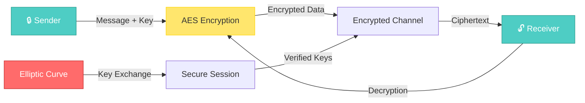
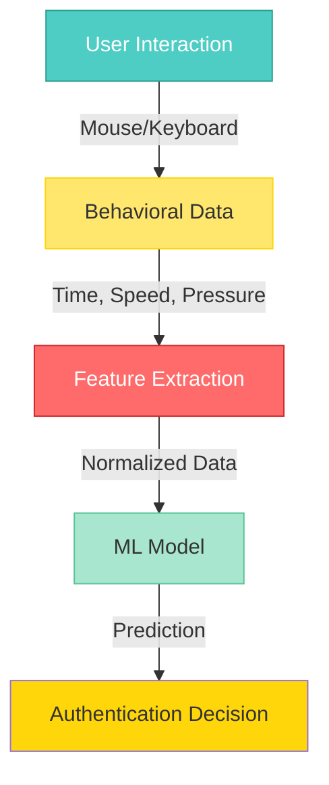
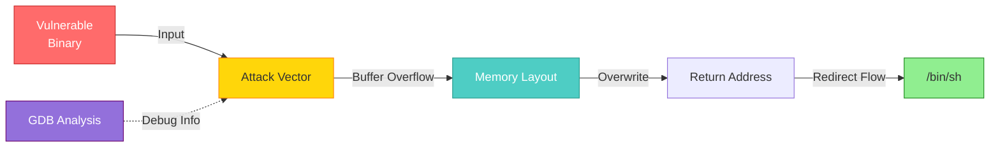
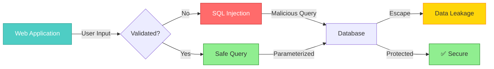
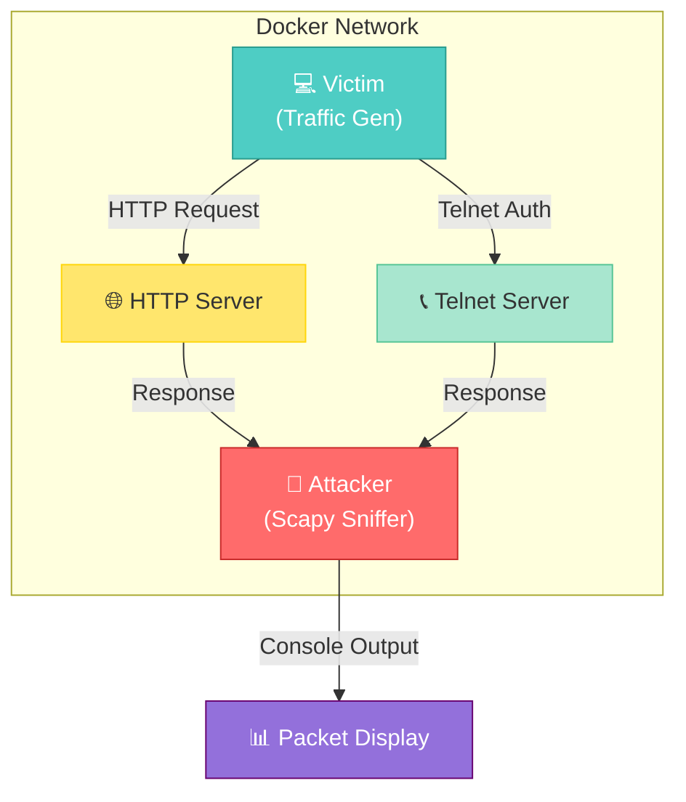

<div align="center">

# 🛡️ Computer Security: Applied & Practical

## Comprehensive Academic Portfolio
> **CSE 405 & CSE 406 | BUET Department of Computer Science & Engineering**

### Cryptography • Binary Exploitation • Web Security • Network Analysis


*A showcase of applied security principles through hands-on implementations and vulnerability analysis*

</div>

---

## 📑 Table of Contents

- [🎯 Overview](#-overview)
- [🏗️ Repository Architecture](#️-repository-architecture)
- [📚 Projects at a Glance](#-projects-at-a-glance)
- [🔄 Learning Progression](#-learning-progression)
- [⚙️ Technology Stack](#️-technology-stack)
- [📊 Repository Statistics](#-repository-statistics)
- [🎓 Key Learning Outcomes](#-key-learning-outcomes)
- [🚀 Getting Started](#-getting-started)
- [⚠️ Disclaimer & Legal Notice](#️-disclaimer--legal-notice)
- [🤝 Contributing](#-contributing)

---

## 🎯 Overview

This repository represents a **comprehensive exploration of modern cybersecurity** through practical implementation and vulnerability analysis. Completed as part of the CSE 405 & CSE 406 coursework at BUET, it demonstrates proficiency across multiple security domains:

### Core Domains Covered

```
┌─────────────────────────────────────────────────────────────┐
│                  COMPUTER SECURITY DOMAINS                  │
├─────────────────────────────────────────────────────────────┤
│                                                             │
│  🔐 CRYPTOGRAPHY           🔓 BINARY EXPLOITATION           │
│  ├─ AES Implementation      ├─ Buffer Overflows             │
│  ├─ ECC Protocols           ├─ Stack Smashing               │
│  └─ Secure Communication    └─ ROP Gadgets                  │
│                                                             │
│  🌐 WEB APPLICATION SECURITY  🔍 NETWORK ANALYSIS           │
│  ├─ SQL Injection          ├─ Packet Sniffing               │
│  ├─ Authentication         ├─ Protocol Analysis             │
│  └─ Biometric Systems      └─ MITM Demonstration            │
│                                                             │
└─────────────────────────────────────────────────────────────┘
```

---

## 🏗️ Repository Architecture

### Directory Structure

```
Computer-Security/
│
├─── 📦 Assignment-01/              [Applied Cryptography]
│    ├─ _2005021_aes.py            → AES Encryption Implementation
│    ├─ _2005021_ecc.py            → Elliptic Curve Cryptography
│    ├─ _2005021_sender.py         → Secure Message Sender
│    ├─ _2005021_receiver.py       → Secure Message Receiver
│    └─ BitVector-3.5.0/           → Cryptographic Bit Operations
│
├─── 📦 Assignment-02/              [Web Authentication & ML]
│    ├─ collect.py                 → Behavioral Data Collection
│    ├─ database.py                → Data Persistence Layer
│    ├─ train.py                   → ML Model Training
│    ├─ app.py                     → Authentication Application
│    └─ static/                    → Web Interface Assets
│
├─── 📦 Online-01/                  [Memory Corruption Exploits]
│    ├─ Online/                    → Buffer Overflow Challenges
│    │  ├─ A1/, A2/, B1/, B2/     → Vulnerability Scenarios
│    │  └─ exploit.py             → Automated Exploit Generation
│    └─ Practice/                  → Training Challenges
│
├─── 📦 Online-02/                  [Web App Vulnerabilities]
│    ├─ A1/, B1/                   → SQL Injection Scenarios
│    └─ practice/sqli-labs/        → Interactive Lab Environment
│
└─── 📦 Packet-Sniffer/             [Network Security Lab]
     ├─ sniffer.py                 → Packet Capture & Analysis
     ├─ generate_traffic.py        → Traffic Generation
     ├─ docker-compose.yml         → Container Orchestration
     └─ Dockerfile.*               → Container Specifications
```

---

## 📚 Projects at a Glance

### 🔐 Assignment-01: Applied Cryptography

<div align="center">



</div>

**📋 Key Components:**
- ✅ **AES-256 Encryption** with CBC mode
- ✅ **ECC Key Agreement** with ECDH protocol
- ✅ **Secure Communication Channel** between sender and receiver
- ✅ **BitVector Library** for efficient bit manipulation

**💡 Learning Focus:** Cryptographic algorithms, key management, secure channels

**📁 Key Files:** `_2005021_aes.py`, `_2005021_ecc.py`, `_2005021_sender.py`, `_2005021_receiver.py`

---

### 🔐 Assignment-02: Authentication & Behavioral Biometrics

<div align="center">



</div>

**📋 Key Components:**
- ✅ **Data Collection** pipeline for behavioral metrics
- ✅ **Machine Learning** model training (Random Forest/SVM)
- ✅ **Database** persistence layer
- ✅ **Web Interface** with JavaScript Web Workers
- ✅ **Real-time Prediction** engine

**💡 Learning Focus:** Authentication mechanisms, ML application, web backend development

**📁 Key Files:** `collect.py`, `train.py`, `database.py`, `app.py`

---

### 💣 Online-01: Binary Exploitation & Memory Corruption

<div align="center">



</div>

**📋 Key Components:**
- ✅ **Buffer Overflow** exploitation techniques
- ✅ **Stack Smashing** and ROP gadgets
- ✅ **GDB Debugging** for memory analysis
- ✅ **Python Exploit** frameworks
- ✅ **Bypass Techniques** (ALSR, DEP, Canaries)

**💡 Learning Focus:** Low-level vulnerabilities, exploitation mechanics, defensive bypassing

**📁 Vulnerability Scenarios:** A1, A2 (Average difficulty), B1, B2 (Advanced difficulty)

---

### 🌐 Online-02: Web Application Vulnerabilities

<div align="center">



</div>

**📋 Key Components:**
- ✅ **Union-Based SQL Injection**
- ✅ **Error-Based SQLi** techniques
- ✅ **Blind SQL Injection** exploitation
- ✅ **sqli-labs** modernized environment
- ✅ **Defensive Measures** & secure coding

**💡 Learning Focus:** Web vulnerabilities, database security, OWASP top 10

**📁 Tools:** DVWA alternatives, MySQL labs, PHP exploitation

---

### 🔍 Packet-Sniffer: Network Security Lab

<div align="center">



</div>

**📋 Key Components:**
- ✅ **Containerized Network** with Docker Compose
- ✅ **Packet Sniffing** with Scapy
- ✅ **Traffic Generation** simulation
- ✅ **MITM Demonstration** on clear-text protocols
- ✅ **Real-time Analysis** console

**💡 Learning Focus:** Network protocols, packet analysis, protocol vulnerabilities

**📁 Key Files:** `sniffer.py`, `generate_traffic.py`, `docker-compose.yml`

---

## 🔄 Learning Progression

The repository is structured to provide a **progressive learning path** from foundational to advanced security concepts:

```
Level 1: FOUNDATIONS
├─ Cryptographic Algorithms (AES, ECC)
└─ Understanding Encryption

     ↓

Level 2: APPLICATIONS
├─ Authentication Systems
├─ Web Development Security
└─ Practical Implementation

     ↓

Level 3: VULNERABILITIES
├─ Identifying Security Flaws
├─ Exploitation Mechanics
└─ Defense Strategies

     ↓

Level 4: ADVANCED ANALYSIS
├─ Network-level Attacks
├─ Protocol Analysis
└─ MITM Scenarios
```

---

## ⚙️ Technology Stack

### 🖥️ Programming Languages

| Language | Purpose | Projects |
|:---------|:--------|:---------|
| **Python 3.x** | Cryptography, Exploits, Network Analysis | All |
| **C** | Vulnerable Programs, Systems Programming | Online-01 |
| **JavaScript** | Web Interface, Data Collection | Assignment-02 |
| **PHP** | Web Applications, Database Interaction | Online-02 |
| **Bash** | Scripting, Docker Management | Packet-Sniffer |

### 🛠️ Tools & Libraries

| Category | Tools |
|:---------|:------|
| **Cryptography** | BitVector, hashlib, PyCryptodome |
| **Network Analysis** | Scapy, tcpdump, Wireshark |
| **Debugging** | GDB (GNU Debugger), Python pdb |
| **Web Frameworks** | Flask, PHP, HTML/CSS/JS |
| **Database** | MySQL, SQLite |
| **Containerization** | Docker, Docker Compose |
| **ML/Data** | scikit-learn, pandas, numpy |

### 🐳 Infrastructure

```yaml
Containerization:
  - Docker (Isolation & Portability)
  - Docker Compose (Multi-container Orchestration)
  - Custom Dockerfiles (Attacker, Victim, Services)

Networking:
  - Bridge Networks (Communication)
  - Port Mapping (Service Exposure)
  - Volume Mounts (Data Persistence)
```

---

## 📊 Repository Statistics

<div align="center">

| Metric | Value |
|:------:|:-----:|
| **Total Projects** | 5 |
| **Python Scripts** | 15+ |
| **C Programs** | 8+ |
| **Dockerfiles** | 4 |
| **Lines of Code** | 2000+ |
| **Cryptographic Implementations** | 2 |
| **Exploitation Techniques** | 8+ |
| **SQL Injection Vectors** | 6+ |

</div>

---

## 🎓 Key Learning Outcomes

Upon completing this coursework, the following competencies are demonstrated:

<div align="left">

```
CRYPTOGRAPHY                    EXPLOITATION
  • AES Implementation          • Buffer Overflow Detection
  • ECC Key Exchange            • Memory Analysis (GDB)
  • Secure Channels             • Payload Crafting
  • Algorithm Analysis          • Bypass Techniques

NETWORK SECURITY              WEB APPLICATIONS
  • Packet Analysis            • SQL Injection Testing
  • Protocol Sniffing          • Authentication Design
  • MITM Scenarios             • Input Validation
  • Traffic Simulation         • Database Security
```

</div>

---

## 🚀 Getting Started

### Prerequisites

```bash
# System Requirements
- Linux/MacOS/Windows (WSL2 recommended)
- Python 3.8+
- Docker & Docker Compose
- GCC Compiler
- GDB Debugger
```

### Quick Setup

```bash
# 1. Clone the repository
git clone https://github.com/AfzalHossan-2005021/Computer-Security.git
cd Computer-Security

# 2. Navigate to a project
cd Assignment-01/
# OR
cd Packet-Sniffer/

# 3. Run project-specific setup
# See individual README.md files for detailed instructions
```

### Project-Specific Documentation

Each project contains its own comprehensive README:

- 📖 [Assignment-01 README](./Assignment-01/README.md) - Cryptography details
- 📖 [Assignment-02 README](./Assignment-02/README.md) - Authentication system
- 📖 [Online-01 README](./Online-01/README.md) - Binary exploitation
- 📖 [Online-02 README](./Online-02/README.md) - Web vulnerabilities
- 📖 [Packet-Sniffer README](./Packet-Sniffer/README.md) - Network analysis

---

## ⚠️ Disclaimer & Legal Notice

### Educational Use Only

**CRITICAL NOTICE:** This repository contains materials, code, and techniques related to **cybersecurity exploitation and vulnerability analysis**. All content is strictly for:

✅ **PERMITTED USES:**
- 📚 Academic learning and research
- 🏫 Computer science education
- 🛡️ Understanding defensive security
- 🔬 Authorized security testing on owned systems

❌ **PROHIBITED USES:**
- 🚫 Unauthorized system access
- 🚫 Data theft or manipulation
- 🚫 Denial of service attacks
- 🚫 Any illegal or malicious activities

### Legal Compliance

**Users are solely responsible for:**
1. ⚖️ Complying with all applicable laws and regulations
2. 🔒 Only testing systems they own or have explicit written permission to test
3. 📋 Understanding and accepting full legal liability for misuse

**The authors assume NO LIABILITY for:**
- Unauthorized use of provided materials
- Damages resulting from code execution
- Legal consequences from misuse

---

## 🤝 Contributing

This is an **academic portfolio repository**. While contributions are appreciated, please note:

- 🔐 This is coursework for CSE 405 & 406
- 📝 Modifications should maintain educational integrity
- 🎓 Please open issues for discrepancies or improvements
- 📧 Contact for collaboration opportunities

---

<div align="center">

### 📌 Quick Links

[🏠 Home](#) • [📚 Documentation](#-projects-at-a-glance) • [💬 Issues](https://github.com/AfzalHossan-2005021/Computer-Security/issues)

---

**🛡️ Computer Security Coursework | BUET CSE**

*Created with ❤️ for cybersecurity education*

*Last Updated: May 2026*

[↑ Back to Top](#-computer-security-applied--practical)

</div>
